# 🏥 Sistema de Cadastro de Currículos - SESAP

## ✅ Requisitos e Links para o Código

- Formulário Web com validações: `public/index.html`
- Processamento no backend (validações, upload, banco, e-mail): `pages/processar.php`
- Estrutura do banco (IP e data/hora): `database/database.sql`
- Envio de e-mail com anexo: `includes/email.php`
- Página de sucesso exibindo IP e data/hora: `pages/sucesso.php`
- Configurações (upload, SMTP, IP, conexão): `includes/config.example.php`

---

## 🧾 Formulário Web

- Arquivo: [public/index.html](public/index.html)

Campos e validações (frontend):

```html
<label for="escolaridade">Escolaridade <span class="required">*</span></label>
<select id="escolaridade" name="escolaridade" required>
    <option value="">Selecione sua escolaridade</option>
    <option value="Ensino Fundamental Incompleto">Ensino Fundamental Incompleto</option>
    <option value="Ensino Fundamental Completo">Ensino Fundamental Completo</option>
    <option value="Ensino Médio Incompleto">Ensino Médio Incompleto</option>
    <option value="Ensino Médio Completo">Ensino Médio Completo</option>
    <option value="Ensino Superior Incompleto">Ensino Superior Incompleto</option>
    <option value="Ensino Superior Completo">Ensino Superior Completo</option>
    <option value="Pós-graduação">Pós-graduação</option>
    <option value="Mestrado">Mestrado</option>
    <option value="Doutorado">Doutorado</option>
</select>

<label for="observacoes">Experiências academicas ou profissionais e habilidades</label>
<textarea id="observacoes" name="observacoes" placeholder="Informações adicionais..."></textarea>

<label for="arquivo">Currículo <span class="required">*</span></label>
<input type="file" id="arquivo" name="arquivo" accept=".doc,.docx,.pdf" required>
```

Validações JS (tipos permitidos e tamanho 1MB):

```html
<script>
document.getElementById('curriculoForm').addEventListener('submit', function(e) {
    let isValid = true;
    const arquivo = document.getElementById('arquivo').files[0];
    if (!arquivo) {
        isValid = false;
    } else {
        const allowedTypes = ['application/pdf', 'application/msword', 'application/vnd.openxmlformats-officedocument.wordprocessingml.document'];
        const maxSize = 1048576; // 1MB
        if (!allowedTypes.includes(arquivo.type)) {
            isValid = false;
        }
        if (arquivo.size > maxSize) {
            isValid = false;
        }
    }
    if (!isValid) { e.preventDefault(); }
});
</script>
```

Referências no código: `public/index.html:240-268`, `public/index.html:321-339`.

---

## 🔒 Validações no Backend

- Arquivo: [pages/processar.php](pages/processar.php)

Obrigatórios e regra de Observações opcional:

```php
$requiredFields = ['nome', 'email', 'telefone', 'cargo_desejado', 'escolaridade'];
$data['observacoes'] = isset($_POST['observacoes']) ? sanitizeInput($_POST['observacoes']) : '';
```

Escolaridade válida, telefone e e-mail:

```php
$escolaridadeValida = [
    'Ensino Fundamental Incompleto',
    'Ensino Fundamental Completo',
    'Ensino Médio Incompleto',
    'Ensino Médio Completo',
    'Ensino Superior Incompleto',
    'Ensino Superior Completo',
    'Pós-graduação',
    'Mestrado',
    'Doutorado'
];

function validatePhone($phone) {
    $phone = preg_replace('/[^0-9]/', '', $phone);
    return preg_match('/^\d{10,11}$/', $phone);
}
```

Arquivo: extensões, MIME e tamanho máximo 1MB:

```php
if ($arquivo['size'] > MAX_FILE_SIZE) { /* 1MB */ }
$extensao = strtolower(pathinfo($arquivo['name'], PATHINFO_EXTENSION));
if (!in_array($extensao, ALLOWED_EXTENSIONS)) { /* .doc/.docx/.pdf */ }
$allowedMimes = [
  'application/pdf',
  'application/msword',
  'application/vnd.openxmlformats-officedocument.wordprocessingml.document'
];
```

Referências no código: `pages/processar.php:27-33`, `pages/processar.php:55-68`, `pages/processar.php:80-104`.

---

## 🗃️ Banco de Dados (IP e Data/Hora)

- Arquivo: [database/database.sql](database/database.sql)

Tabela `curriculos` com campos exigidos:

```sql
CREATE TABLE IF NOT EXISTS curriculos (
    id INT AUTO_INCREMENT PRIMARY KEY,
    nome VARCHAR(255) NOT NULL,
    email VARCHAR(255) NOT NULL,
    telefone VARCHAR(20) NOT NULL,
    cargo_desejado TEXT NOT NULL,
    escolaridade VARCHAR(100) NOT NULL,
    observacoes TEXT,
    arquivo_nome VARCHAR(255) NOT NULL,
    arquivo_caminho VARCHAR(500) NOT NULL,
    ip_envio VARCHAR(45) NOT NULL,
    data_envio DATETIME DEFAULT CURRENT_TIMESTAMP
);
```

Inserção incluindo IP do envio:

```php
$sql = "INSERT INTO curriculos (...) VALUES (..., :ip_envio)";
$params[':ip_envio'] = getUserIP();
```

Referências no código: `database/database.sql:7-21`, `pages/processar.php:171-189`.

---

## ✉️ Envio de E-mail com Anexo

- Arquivo: [includes/email.php](includes/email.php)

Uso de PHPMailer com anexo e dados do formulário:

```php
$mail->addAttachment($caminhoArquivo, $nomeArquivo);
$mail->isHTML(true);
$mail->Subject = 'Novo Currículo Recebido - ' . $dados['nome'];
// Campos: Nome, E-mail, Telefone, Cargo, Escolaridade, Observações (se houver)
$htmlBody .= "<span class='label'>IP de Envio:</span>" . getUserIP();
$htmlBody .= date('d/m/Y') . " às " . date('H:i:s');
```

Referências no código: `includes/email.php:37-44`, `includes/email.php:68-87`, `includes/email.php:98-105`.

---

## 🟢 Página de Sucesso (IP e Data/Hora)

- Arquivo: [pages/sucesso.php](pages/sucesso.php)

Exibição do IP e data/hora:

```php
<?php echo date('d/m/Y') . ' às ' . date('H:i:s'); ?>
<?php echo htmlspecialchars($ip); ?>
```

Referências no código: `pages/sucesso.php:242-249`.

---

## ⚙️ Configuração Necessária

- Copiar `includes/config.example.php` para `includes/config.php` e ajustar:

```php
define('UPLOAD_DIR', 'uploads/');
define('MAX_FILE_SIZE', 1048576);
define('ALLOWED_EXTENSIONS', ['doc', 'docx', 'pdf']);
define('SMTP_USERNAME', 'seu_email@gmail.com');
define('SMTP_PASSWORD', 'sua_senha_app');
define('EMAIL_FROM', 'seu_email@gmail.com');
define('EMAIL_TO', 'rh@sesap.rn.gov.br');
```

Referências no código: `includes/config.example.php:20-23`, `includes/config.example.php:12-18`.


<div align="center">

[](https://php.net)
[](https://mysql.com)
[](https://httpd.apache.org)


**Sistema web moderno para cadastro e gerenciamento de currículos**

[🚀 Instalação](#-instalação) • [📖 Como Usar](#-como-usar) • [🔧 Configuração](#-configuração) • [🐛 Suporte](#-suporte)

</div>

---

## 📋 Índice

- [🎯 Sobre o Projeto](#-sobre-o-projeto)
- [✨ Funcionalidades](#-funcionalidades)
- [🛠️ Tecnologias](#️-tecnologias)
- [📋 Pré-requisitos](#-pré-requisitos)
- [🚀 Instalação](#-instalação)
- [🔧 Configuração](#-configuração)
- [📖 Como Usar](#-como-usar)
- [📁 Estrutura do Projeto](#-estrutura-do-projeto)
- [🔐 Segurança](#-segurança)
- [🐛 Solução de Problemas](#-solução-de-problemas)
- [📞 Suporte](#-suporte)

---

## 🎯 Sobre o Projeto

O Sistema de Cadastro de Currículos SESAP é uma aplicação web desenvolvida inicialmente em localhost, especificamente para facilitar o processo de recrutamento e seleção da Secretaria de Estado da Saúde Pública do Rio Grande do Norte.
 

### 🌟 Principais Características

- 🎨 **Interface Moderna**: Design responsivo e intuitivo
- 🔒 **Seguro**: Proteção contra vulnerabilidades comuns
- 📱 **Mobile-First**: Otimizado para dispositivos móveis
- 📧 **Notificações**: Sistema automático de emails
- 🔍 **Busca Avançada**: Filtros inteligentes para administradores

---

## ✨ Funcionalidades

### 👤 Para Candidatos
- ✅ Formulário de cadastro intuitivo e responsivo
- ✅ Upload de currículos (PDF, DOC, DOCX) - máximo 1MB
- ✅ Validação em tempo real dos dados
- ✅ Confirmação automática por email
- ✅ Dashboard pessoal para acompanhar status
- ✅ Interface acessível e moderna

### 👨‍💼 Para Administradores
- ✅ Painel administrativo completo
- ✅ Sistema de busca e filtros avançados
- ✅ Visualização detalhada de currículos
- ✅ Download de arquivos anexados
- ✅ Envio de emails de confirmação
- ✅ Gerenciamento completo (editar/excluir)

### 🔧 Recursos Técnicos
- ✅ Arquitetura MVC organizada
- ✅ Validação dupla (frontend/backend)
- ✅ Proteção contra SQL Injection
- ✅ Sistema de logs detalhado
- ✅ Backup automático de dados
- ✅ Interface responsiva (mobile-first)

---

## 🛠️ Tecnologias

| Categoria | Tecnologia | Versão |
|-----------|------------|--------|
| **Backend** | PHP | 8.2+ |
| **Banco de Dados** | MySQL | 8.0+ |
| **Servidor Web** | Apache/Nginx | 2.4+ |
| **Frontend** | HTML5, CSS3, JavaScript | ES6+ |
| **Email** | PHPMailer | 6.10+ |
| **Dependências** | Composer | 2.0+ |

---

## 📋 Pré-requisitos

Antes de começar, certifique-se de ter instalado:

- ✅ **PHP 8.0+** com extensões: `pdo`, `pdo_mysql`, `mbstring`, `openssl`
- ✅ **MySQL 8.0+** ou MariaDB 10.4+
- ✅ **Apache 2.4+** ou Nginx 1.18+
- ✅ **Composer** (gerenciador de dependências PHP)
- ✅ **Conta SMTP** (Gmail recomendado para emails)

### 🖥️ Para Windows (XAMPP)
- ✅ **XAMPP 8.2+** - [Download aqui](https://sourceforge.net/projects/xampp/files/)
- ✅ **Git** - [Download aqui](https://git-scm.com/download/win)
- ✅ **VS Code** - [Download aqui](https://code.visualstudio.com/download)

---

## 🚀 Instalação

### Método 1: Instalação com XAMPP (Windows)

#### 1️⃣ Preparar o Ambiente
```powershell
# Baixe e instale o XAMPP
# Inicie o Apache e MySQL no painel de controle do XAMPP
```

#### 2️⃣ Clonar o Projeto
```powershell
# Navegue até a pasta htdocs do XAMPP
cd C:\xampp\htdocs
# Os arquivos do projeto deve está no caminho 
cd C:\xampp\htdocs

# Clone o repositório
git clone [url-do-repositorio] sesap_curriculo
cd sesap_curriculo
```

#### 3️⃣ Instalar Dependências
```powershell
# Instale o Composer se não tiver
# Depois execute:
composer install
```

#### 4️⃣ Configurar Banco de Dados
```sql
-- Acesse o phpMyAdmin (http://localhost/phpmyadmin)
-- Ou use o MySQL via linha de comando:

-- Criar banco de dados
CREATE DATABASE sesap_curriculo CHARACTER SET utf8mb4 COLLATE utf8mb4_unicode_ci;

-- Usar o banco
USE sesap_curriculo;

-- Importar estrutura
SOURCE database/database.sql;

-- (Opcional) Atualizar timezone
SOURCE database/update_timezone.sql;
```

#### 5️⃣ Configurar Sistema
```powershell
# Copie o arquivo de exemplo
copy includes\config.example.php includes\config.php

# Edite o arquivo includes\config.php com suas configurações
```

### Método 2: Instalação Manual (Linux/Mac)

#### 1️⃣ Clonar e Preparar
```bash
git clone [url-do-repositorio] sesap_curriculo
cd sesap_curriculo
composer install
```

#### 2️⃣ Configurar Banco
```bash
mysql -u root -p -e "CREATE DATABASE sesap_curriculo CHARACTER SET utf8mb4 COLLATE utf8mb4_unicode_ci;"
mysql -u root -p sesap_curriculo < database/database.sql
```

#### 3️⃣ Configurar Permissões
```bash
chmod 755 uploads/
chmod 644 uploads/.htaccess
chown -R www-data:www-data uploads/
```

---

## 🔧 Configuração

### 📝 Arquivo de Configuração

Edite o arquivo <mcfile name="config.php" path="includes/config.php"></mcfile>:

```php
<?php
// 🗄️ Configurações do Banco de Dados
define('DB_HOST', 'localhost');
define('DB_NAME', 'sesap_curriculo');
define('DB_USER', 'root');           // Seu usuário MySQL
define('DB_PASS', '');               // Sua senha MySQL

// 📧 Configurações SMTP (Gmail)
define('SMTP_HOST', 'smtp.gmail.com');
define('SMTP_PORT', 587);
define('SMTP_USERNAME', 'seu_email@gmail.com');
define('SMTP_PASSWORD', 'sua_senha_de_app');    // Senha de app do Gmail
define('EMAIL_FROM', 'seu_email@gmail.com');
define('EMAIL_TO', 'rh@sesap.rn.gov.br');

// 🔐 Configurações de Segurança
define('UPLOAD_MAX_SIZE', 1048576);  // 1MB em bytes
define('ALLOWED_EXTENSIONS', ['pdf', 'doc', 'docx']);
?>
```

### 📧 Configuração do Gmail

1. **Ativar 2FA**: Vá em Configurações → Segurança → Verificação em duas etapas
2. **Gerar Senha de App**: Configurações → Segurança → Senhas de app
3. **Usar a Senha**: Cole a senha gerada no `SMTP_PASSWORD`

---

## 🖼️ Demonstração do Sistema

### 🎨 Interfaces do Sistema

O sistema possui três interfaces principais, cada uma com design moderno e responsivo:

#### 🏠 **Página Inicial** - Portal de Cadastro
- **Design**: Interface limpa com gradiente azul/roxo
- **Funcionalidades**: Formulário de cadastro completo para candidatos
- **Elementos**: Campos validados, upload de arquivo, botões de ação
- **Responsividade**: Otimizada para desktop e mobile

#### 👤 **Área do Candidato** - Dashboard Pessoal
- **Design**: Layout moderno com cards informativos
- **Funcionalidades**: Visualização dos dados enviados, status da candidatura
- **Elementos**: Informações pessoais, dados do currículo, ações disponíveis
- **Segurança**: Acesso via email cadastrado

#### 👨‍💼 **Painel Administrativo** - Gestão Completa
- **Design**: Interface profissional com tabelas e filtros
- **Funcionalidades**: CRUD completo, busca avançada, downloads
- **Elementos**: Estatísticas, listagem paginada, ações em lote
- **Recursos**: Visualização detalhada, edição inline, confirmações

### 🎯 Fluxo de Uso

```mermaid
graph TD
    A[Candidato acessa página inicial] --> B[Preenche formulário]
    B --> C[Anexa currículo PDF/DOC]
    C --> D[Submete dados]
    D --> E[Recebe confirmação por email]
    E --> F[Acessa dashboard pessoal]
    
    G[Admin acessa painel] --> H[Visualiza todos os currículos]
    H --> I[Filtra por critérios]
    I --> J[Visualiza/Edita/Baixa]
    J --> K[Envia confirmações]
```



### 📱 Responsividade

O sistema é **mobile-first** e se adapta perfeitamente a:
- 📱 **Smartphones** (320px+)
- 📱 **Tablets** (768px+)
- 💻 **Desktops** (1024px+)
- 🖥️ **Telas grandes** (1440px+)

---

## 📖 Como Usar

### 🌐 URLs de Acesso

| Área | URL | Descrição |
|------|-----|-----------|
| **Página Inicial** | `http://localhost/sesap_curriculo/public/index.html` | Landing page do sistema |
| **Área do Usuário** | `http://localhost/sesap_curriculo/pages/user/user_login.php` | Portal do candidato |
| **Área Administrativa** | `http://localhost/sesap_curriculo/pages/admin/login.php` | Painel administrativo |

### 👤 Para Candidatos

1. **Acesse** a área do usuário
2. **Cadastre-se** preenchendo todos os campos obrigatórios
3. **Anexe** seu currículo (PDF, DOC ou DOCX - máx. 1MB)
4. **Envie** o formulário
5. **Confirme** através do email recebido
6. **Acompanhe** o status no dashboard pessoal

### 👨‍💼 Para Administradores

**Credenciais Padrão:**
- 👤 **Usuário:** `SESAP`
- 🔑 **Senha:** `admin123`

> ⚠️ **IMPORTANTE**: Altere essas credenciais em produção!

**Funcionalidades:**
1. **Login** com credenciais administrativas
2. **Visualizar** todos os currículos cadastrados
3. **Filtrar** por nome, email, cargo ou data
4. **Baixar** currículos em PDF
5. **Editar** informações dos candidatos
6. **Excluir** registros quando necessário
7. **Enviar** emails de confirmação

---

## 📁 Estrutura do Projeto

```
sesap_curriculo/
├── 📁 database/                    # 🗄️ Scripts de banco de dados
│   ├── database.sql               # Estrutura principal das tabelas
│   ├── migrate_to_blob.sql        # Migração para BLOB (se necessário)
│   └── update_timezone.sql        # Atualização de timezone
├── 📁 includes/                    # ⚙️ Configurações e utilitários
│   ├── config.example.php         # Exemplo de configuração
│   ├── config.php                 # Configurações do sistema
│   └── email.php                  # Sistema de envio de emails
├── 📁 pages/                       # 📄 Páginas da aplicação
│   ├── 📁 admin/                   # Área administrativa
│   │   ├── admin.php              # Dashboard administrativo
│   │   ├── login.php              # Login de administrador
│   │   └── logout.php             # Logout administrativo
│   ├── 📁 user/                    # Área do usuário
│   │   ├── user_dashboard.php     # Dashboard do candidato
│   │   ├── user_login.php         # Login/cadastro de usuário
│   │   └── user_logout.php        # Logout do usuário
│   ├── 📁 uploads/                 # 📎 Currículos enviados
│   ├── download.php               # Download de arquivos
│   ├── processar.php              # Processamento de formulários
│   ├── sucesso.php                # Página de confirmação
│   └── visualizar.php             # Visualização detalhada
├── 📁 public/                      # 🌐 Arquivos públicos
│   └── index.html                 # Página inicial do sistema
├── 📁 uploads/                     # 📂 Diretório de uploads
│   └── .htaccess                  # Proteção de acesso direto
├── 📁 vendor/                      # 📦 Dependências (Composer)
├── 📄 index.php                   # Ponto de entrada principal
├── 📄 composer.json               # Dependências PHP
├── 📄 composer.lock               # Lock de versões
├── 📄 .gitignore                  # Arquivos ignorados pelo Git
└── 📄 README.md                   # Este arquivo
```

---

## 🔐 Segurança

### 🛡️ Medidas Implementadas

- ✅ **Validação de Dados**: Sanitização completa de inputs
- ✅ **SQL Injection**: Proteção via PDO prepared statements
- ✅ **Upload Seguro**: Validação de tipo e tamanho de arquivo
- ✅ **Proteção de Diretórios**: .htaccess configurado
- ✅ **Headers de Segurança**: Configurações HTTP adequadas
- ✅ **Logs de Auditoria**: Registro de ações importantes

> ⚠️ **CRÍTICO**: Altere essas credenciais imediatamente em produção!

### 🔒 Recomendações de Segurança

1. **Alterar credenciais padrão**
2. **Usar HTTPS em produção**
3. **Configurar firewall adequado**
4. **Manter sistema atualizado**
5. **Fazer backups regulares**
6. **Monitorar logs de acesso**

---

## 🐛 Solução de Problemas

### ❌ Problemas Comuns

<details>
<summary><strong>📧 Email não está sendo enviado</strong></summary>

**Possíveis causas:**
- Configurações SMTP incorretas
- Senha de app do Gmail inválida
- Firewall bloqueando porta 587

**Soluções:**
```powershell
# Verificar configurações
findstr "SMTP_" includes\config.php

# Testar conectividade SMTP
telnet smtp.gmail.com 587

# Verificar logs de erro
Get-Content C:\xampp\apache\logs\error.log -Tail 50
```
</details>

<details>
<summary><strong>📁 Upload de arquivo falha</strong></summary>

**Possíveis causas:**
- Permissões incorretas no diretório uploads/
- Arquivo muito grande (>1MB)
- Tipo de arquivo não permitido

**Soluções:**
```powershell
# Verificar permissões (Windows)
icacls uploads

# Testar escrita no diretório
echo "teste" > uploads\test.txt
del uploads\test.txt

# Verificar configurações PHP
php -i | findstr upload
```
</details>

<details>
<summary><strong>🗄️ Erro de conexão com banco</strong></summary>

**Possíveis causas:**
- MySQL não está rodando
- Credenciais incorretas
- Banco de dados não existe

**Soluções:**
```powershell
# Verificar se MySQL está rodando
netstat -an | findstr 3306

# Testar conexão
mysql -u root -p -e "SELECT 1;"

# Verificar se banco existe
mysql -u root -p -e "SHOW DATABASES LIKE 'sesap_curriculo';"
```
</details>

### 🔧 Comandos de Diagnóstico

```powershell
# Verificar versão PHP
php -v

# Verificar extensões PHP
php -m | findstr -i "pdo mysql"

# Verificar logs de erro
Get-Content C:\xampp\apache\logs\error.log -Tail 20

# Testar configuração
php -l includes\config.php
```

---

## 🧭 Mapa de Requisitos → Código

- Formulário com campos obrigatórios (Nome, E-mail, Telefone, Cargo Desejado, Escolaridade) e Observações (opcional), além de upload de arquivo
  - Frontend: `public/index.html` (formulário `#curriculoForm`)
    - Campos: `nome`, `email`, `telefone`, `cargo_desejado`, `escolaridade`, `observacoes`, `arquivo`
    - Upload: input `type="file"` com `accept=".doc,.docx,.pdf"`
  - Observações opcional: campo `observacoes` sem `required` no HTML

- Validações do formulário
  - Validação em tempo real (frontend): `public/index.html`
    - Bloco JS: valida Nome, E-mail, Telefone, Cargo, Escolaridade, e Arquivo (tipo e tamanho 1MB)
  - Validação no backend: `pages/processar.php`
    - Checagem de obrigatórios: `['nome','email','telefone','cargo_desejado','escolaridade']`
    - E-mail: `isValidEmail()` (definida em `includes/config.php`)
    - Telefone: `validatePhone()` (DDD + 8/9 dígitos)
    - Escolaridade: validação contra lista permitida
    - Arquivo: checa extensão (`ALLOWED_EXTENSIONS`), tamanho (`MAX_FILE_SIZE` = 1MB) e MIME (`finfo`)

- Restrições de arquivo (.doc, .docx, .pdf) e tamanho máximo 1MB
  - Frontend: `public/index.html`
    - `accept=".doc,.docx,.pdf"` e validação JS `allowedTypes` + `maxSize = 1048576`
  - Backend: `pages/processar.php`
    - Extensão: `pathinfo(..., PATHINFO_EXTENSION)` + `ALLOWED_EXTENSIONS`
    - MIME permitido: `application/pdf`, `application/msword`, `application/vnd.openxmlformats-officedocument.wordprocessingml.document`
    - Tamanho: `$_FILES['arquivo']['size'] > MAX_FILE_SIZE`
  - Configurações: `includes/config.example.php`
    - `MAX_FILE_SIZE = 1048576` (1MB)
    - `ALLOWED_EXTENSIONS = ['doc','docx','pdf']`

- Armazenamento no banco de dados com IP e data/hora
  - Estrutura do banco: `database/database.sql`
    - Tabela `curriculos` com colunas: `ip_envio`, `data_envio` (DEFAULT CURRENT_TIMESTAMP), e campos do candidato
  - BLOB opcional para arquivo: `database/migrate_to_blob.sql`
    - Campos `arquivo_conteudo`, `arquivo_tamanho`, `arquivo_mime_type`
  - Inserção: `pages/processar.php`
    - `INSERT INTO curriculos (...) VALUES (...)` incluindo `ip_envio = getUserIP()`
  - Timezone: `includes/config.example.php`
    - `date_default_timezone_set('America/Sao_Paulo')`

- Envio de e-mail com dados do formulário e arquivo em anexo
  - Serviço de e-mail: `includes/email.php`
    - Função `enviarEmail($dados, $caminhoArquivo, $nomeArquivo)` usa PHPMailer
    - Anexo: `$mail->addAttachment($caminhoArquivo, $nomeArquivo)`
    - Corpo: HTML com Nome, E-mail, Telefone, Cargo, Escolaridade, Observações (se houver), IP e Data/Hora
  - Comprovante para candidato (opcional): `enviarComprovante($dados)`
  - Configurar SMTP em `includes/config.php` (copiar de `includes/config.example.php` e ajustar `SMTP_USERNAME`, `SMTP_PASSWORD`, `EMAIL_FROM`, `EMAIL_TO`)

- Exibição de sucesso com IP e data/hora
  - Página: `pages/sucesso.php`
    - Mostra IP (`$_SESSION['ip_envio']`) e `date('d/m/Y H:i:s')`
    - Acesso à área do candidato e download do currículo

---

## 🔎 Como Verificar Cada Requisito

- Abrir `public/index.html` e conferir os campos do formulário e validações JS.
- Abrir `pages/processar.php` para ver sanitização, validações, regras de arquivo e `INSERT` no banco.
- Abrir `database/database.sql` e `database/migrate_to_blob.sql` para conferir a estrutura da tabela.
- Abrir `includes/email.php` para ver PHPMailer, anexo e corpo do e-mail.
- Abrir `includes/config.example.php` para confirmar `ALLOWED_EXTENSIONS`, `MAX_FILE_SIZE`, timezone e helpers (`getUserIP`, `isValidEmail`).
- Acessar `pages/sucesso.php` para visualizar a confirmação com IP e data/hora.

---

## 🧪 Fluxo de Teste Rápido

- Acesse `http://localhost/sesap_curriculo/public/index.html`.
- Preencha os campos obrigatórios e anexe `.pdf`/`.doc`/`.docx` até 1MB.
- Envie e confirme que:
  - Redireciona e exibe a página de sucesso com IP e horário.
  - Registro aparece no banco (`curriculos`).
  - E-mail chega ao destinatário definido em `EMAIL_TO` com o arquivo anexado.

## 📞 Suporte

### 🆘 Precisa de Ajuda?

- 📧 **Email**: juniorrsilva50@gmail.com
- 📱 **Telefone**: (84) 99420-xxxx
- 🐛 **Issues**: [Reportar Bug](https://github.com/seu-usuario/sesap-curriculo/issues)

### 🤝 Contribuindo

1. **Fork** o projeto
2. **Crie** uma branch para sua feature (`git checkout -b feature/AmazingFeature`)
3. **Commit** suas mudanças (`git commit -m 'Add some AmazingFeature'`)
4. **Push** para a branch (`git push origin feature/AmazingFeature`)
5. **Abra** um Pull Request

### 📋 Reportando Bugs

Ao reportar um bug, inclua:

- ✅ **Descrição detalhada** do problema
- ✅ **Passos para reproduzir** o erro
- ✅ **Ambiente** (OS, PHP, MySQL, navegador)
- ✅ **Screenshots** se aplicável
- ✅ **Logs de erro** relevantes

---

## 🚀 Próximas Funcionalidades

- 🔄 **API REST** para integrações externas
- 🔄 **Dashboard com gráficos** e estatísticas
- 🔄 **Sistema de notificações** push
- 🔄 **Exportação** em múltiplos formatos
- 🔄 **Templates de email** personalizáveis
- 🔄 **Autenticação** via OAuth (Google/Microsoft)

---

<div align="center">

## 🏥 Desenvolvido para SESAP-RN

**Sistema de Gestão de Currículos v1.0**

*Facilitando o processo de recrutamento e seleção da Secretaria de Estado da Saúde Pública do Rio Grande do Norte*

---

[](https://github.com/seu-usuario)
[](https://php.net)
[](https://mysql.com)

**© 2024 - Todos os direitos reservados.**

</div>
